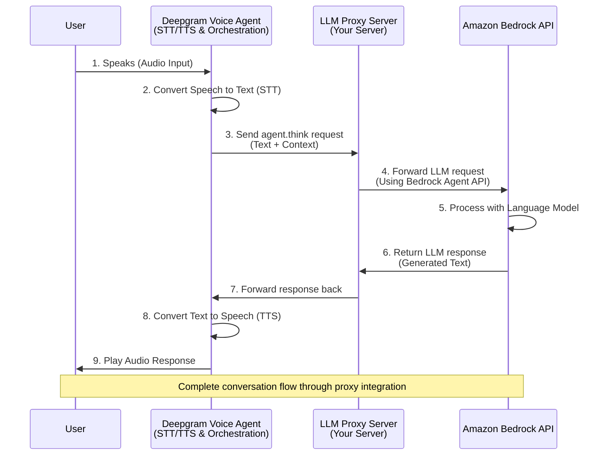

***

title: Amazon Bedrock and Deepgram Voice Agent
subtitle: >-
Use Amazon Bedrock with Deepgram Voice Agent either natively or via a proxy
server.
slug: docs/amazon-bedrock-and-deepgram-voice-agent
--------------------------------------------------

This guide walks you through two methods to use **Amazon Bedrock** with Deepgram Voice Agent:

1. **Native Integration** (Recommended) - Use the built-in `aws_bedrock` provider type
2. **Proxy Server** - Route requests through a proxy server for advanced use cases

## Before you Begin

<Info>
  Before you can use Deepgram, you'll need to [create a Deepgram account](https://console.deepgram.com/signup?jump=keys). Signup is free and includes **\$200** in free credit and access to all of Deepgram's features!
</Info>

<Info>
  Before you start, you'll need to follow the steps in the [Make Your First API Request](/guides/fundamentals/make-your-first-api-request) guide to obtain a Deepgram API key, and configure your environment if you are choosing to use a Deepgram SDK.
</Info>

## Method 1: Native Integration (Recommended)

<Info>
  Native AWS Bedrock support is now available directly in the Voice Agent API using the `aws_bedrock` provider type.
</Info>

### Prerequisites

* An Amazon Bedrock service account with appropriate permissions
* AWS credentials (Access Key ID and Secret Access Key)
* Access to desired Bedrock models in your AWS account

### Configuration

Configure your Voice Agent with the `aws_bedrock` provider type. You can use either IAM credentials or STS (temporary) credentials:

#### Using IAM Credentials

```json
{
  "agent": {
    "think": {
      "provider": {
        "type": "aws_bedrock",
        "model": "us.anthropic.claude-3-5-sonnet-20241022-v2:0",
        "temperature": 0.7,
        "credentials": {
          "type": "iam",
          "region": "us-east-2",
          "access_key_id": "{{your_access_key_id}}",
          "secret_access_key": "{{your_secret_access_key}}"
        }
      },
      "endpoint": {
        "url": "https://bedrock-runtime.us-east-2.amazonaws.com/"
      }
    }
  }
}
```

#### Using STS (Temporary) Credentials

```json
{
  "agent": {
    "think": {
      "provider": {
        "type": "aws_bedrock",
        "model": "us.anthropic.claude-3-5-sonnet-20241022-v2:0",
        "temperature": 0.7,
        "credentials": {
          "type": "sts",
          "region": "us-east-2",
          "access_key_id": "{{your_temporary_access_key_id}}",
          "secret_access_key": "{{your_temporary_secret_access_key}}",
          "session_token": "{{your_session_token}}"
        }
      },
      "endpoint": {
        "url": "https://bedrock-runtime.us-east-2.amazonaws.com/"
      }
    }
  }
}
```

<Warning>
  Ensure your AWS credentials have the necessary permissions to invoke Bedrock models. The endpoint URL should match your AWS region.
</Warning>

## Method 2: Proxy Server Integration

For advanced use cases or if you need additional processing between Deepgram and Bedrock, you can use a proxy server.

### Prerequisites

<Info>
  For the complete code for the proxy used in this guide, please check out this:
  [repository](https://github.com/deepgram-devs/deepgram-voice-agent-client-llm-proxy/tree/main)
</Info>

You will need:

* An understanding of Python and using Python virtual environments.
* An [Amazon Bedrock service account](https://docs.aws.amazon.com/bedrock/latest/userguide/what-is-bedrock.html)
* A Deepgram Voice Agent. Here's [our guide](https://developers.deepgram.com/docs/voice-agent) on building the voice agent.
* [ngrok](https://ngrok.com/) to allow access to a local server OR your own hosted server

### Architecture Overview (Proxy Method)



**How it works:**

* The proxy logs and forwards `agent.think` payloads to Bedrock
* Bedrock handles LLM logic and returns structured responses
* Deepgram converts the response into speech back to the user

### Set Up the Proxy

### Clone the proxy repo

```bash
git clone https://github.com/deepgram-devs/deepgram-voice-agent-client-llm-proxy.git
cd deepgram-voice-agent-client-llm-proxy
python3 -m venv venv
source venv/bin/activate
pip install -r requirements.txt
```

### Configure the environment

```bash
cp .env.example .env
```

### Specifying Bedrock provider details

```env
AGENT_ID=your_bedrock_agent_id
AGENT_ALIAS_ID=your_bedrock_agent_alias_id
AWS_ACCESS_KEY_ID=your_aws_access_key_id
AWS_SECRET_ACCESS_KEY=your_aws_secret_access_key
AWS_REGION=us-east-1
```

### Start the server

```bash
python app.py
```

### Using ngrok

<Warning>
  ngrok is recommended for quick development and testing but shouldn't be used for production instances.
  Follow [these steps](https://github.com/deepgram-devs/deepgram-voice-agent-client-llm-proxy/tree/main?tab=readme-ov-file#running-locally-with-ngrok) to configure ngrok.
</Warning>

Be sure to set the port correctly to `5000` by running:

```bash
ngrok http 5000
```

### Configure Deepgram Voice Agent (Proxy Method)

In your Deepgram Voice Agent settings, update the provider, model, and endpoint URL for `agent.think`.
See more examples of configuration [here](https://developers.deepgram.com/docs/configure-voice-agent#full-example).

```json
"agent": {
  "think": {
    "provider": {
      "type": "open_ai",
      "model": "gpt-4o-mini",
      "temperature": 0.7
    },
    "endpoint": {
      "url": "{{host}}/v1/chat/completions",
      "headers": {
        "authorization": "Bearer {{token}}"
      }
    }
  }
}
```

### Test the Integration

1. Launch the proxy and ngrok
2. Deploy your Deepgram Voice Agent with the updated config
3. Start a call or session
4. Observe `agent.think` payloads and Bedrock responses in proxy logs
5. Confirm LLM responses originate from Bedrock (e.g., function calls reflected)
