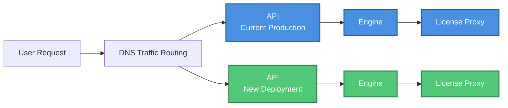

***

title: Blue-Green Deployment
subtitle: >-
Blue-green deployments are an effective strategy for managing self-hosted
updates, especially in cases when backwards compatibility is not maintained
and multiple container dependencies exist.
slug: docs/blue-green-deployment
--------------------------------

Blue-green deployments involve maintaining two identical production environments during updates. The Blue deployment represents the current production environment serving live traffic, while the Green deployment represents the new version to be released.

This strategy is particularly effective when backwards compatibility is not maintained between versions or when multiple container dependencies must be updated together. By deploying changes to the inactive environment first, you can test and verify updates in a production-like setting without impacting end-users.

## How It Works

1. **Deploy to Green Environment**: Deploy the new version to the currently-unused Green environment, while Blue continues serving production traffic
2. **Test and Verify**: Thoroughly test the Green environment to ensure it functions correctly without impacting users
3. **Route Traffic**: When ready, route incoming requests to the Green environment with zero downtime
4. **Monitor**: Closely monitor the Green environment for any issues after traffic begins flowing to it
5. **Rollback or Commit**: If issues arise, instantly rollback to Blue; if stable, promote Green to production and decommission Blue

## Benefits

* **Zero Downtime**: Traffic switching happens instantly without service interruption
* **Instant Rollback**: If problems occur, reverting to the previous version is immediate
* **Safe Testing**: Test the new deployment in a production-identical environment
* **Risk Reduction**: Minimize operational risk during updates with a clear fallback plan

## When to Use Blue-Green Deployment

Consider using blue-green deployment when:

* Deploying updates with breaking changes between API, Engine, and/or License Proxy containers
* Multiple container dependencies must be updated together
* Backwards compatibility cannot be maintained between versions
* Zero-downtime updates are required for production systems

## Architecture

***

## What's Next

Now that you understand blue-green deployment strategies, explore related topics:

* [System Maintenance](/docs/maintaining) - Updating and maintaining your deployment
* [Auto-scaling](/docs/autoscaling-best-practices) - Scaling your deployment based on demand
* [Metrics Guide](/docs/metrics-guide) - Monitoring your deployment health
