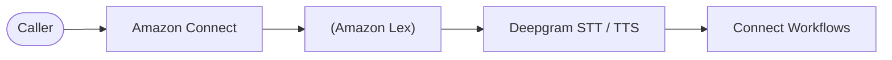

***

title: Amazon Connect and Deepgram
subtitle: >-
Integrate Deepgram's Speech-to-Text (STT) and Text-to-Speech (TTS) models
directly into Amazon Connect and Amazon Lex to power intelligent IVR systems
and virtual voice agents.
slug: docs/deepgram-with-amazon-connect
---------------------------------------

This guide explains how to integrate your Deepgram models into Amazon Connect flow.

## Overview

[Amazon Connect](https://docs.aws.amazon.com/connect/) is AWS's cloud-based contact center platform, and [Amazon Lex](https://docs.aws.amazon.com/lexv2/latest/dg/what-is.html) provides tools for quickly building conversational chatbots. With Deepgram integrated into Connect, organizations can seamlessly replace AWS Transcribe and Polly with Deepgram's STT and TTS models—without modifying their existing Connect flows or operational logic.

<Info>
  This integration supports **Deepgram-hosted** customers only. Support for **self-hosted** deployments will be added in a future phase.
</Info>

## Architecture

* **Connect/Lex → Deepgram (STT):** Live caller audio is streamed to Deepgram for real-time transcription.

* **Deepgram → Connect/Lex:** The transcript is returned instantly for intent recognition or routing logic.

* **Connect/Lex → Deepgram (TTS):** Lex sends text to Deepgram TTS model to generate natural spoken responses.

## Prerequisites

Before starting:

* An active **Deepgram** account
* An active **AWS** account
* A **Deepgram API key**
* An **Amazon Connect** instance, and Amazon Lex bot if using Lex

<Info>
  Before you can use Deepgram, you'll need to [create a Deepgram account](https://console.deepgram.com/signup?jump=keys). Signup is free and includes **\$200** in free credit and access to all of Deepgram's features!
</Info>

## Get Your Deepgram API Key and Add as AWS Secret

1. Sign in to the [**Deepgram Console**](https://console.deepgram.com/).

2. Go to **API Keys → Create API Key**.

3. Copy the generated key — you'll need it in AWS Connect.

4. Follow these steps to store the Deepgram API key in your [AWS Secrets Manager](https://docs.aws.amazon.com/lexv2/latest/dg/customizing-speech-deepgram-setup.html#secrets-manager-setup)

## Configure Deepgram in Amazon Lex

If you're using Amazon Lex bots in your Connect flow, follow the AWS guide to set up Deepgram in [Amazon Lex](https://docs.aws.amazon.com/lexv2/latest/dg/customizing-speech-deepgram-setup.html).

## Configure Deepgram STT in Amazon Connect

Follow the AWS guide to configure Deepgram as the STT provider in your [Amazon Connect bots](https://docs.aws.amazon.com/connect/latest/adminguide/configure-third-party-stt.html).

1. Under Model Type, select Speech-to-Text
2. Under Voice Provider, select Deepgram
3. Under Model Id, fill in the Deepgram model you want to use, e.g. `nova-3-general`. Please see the full list of supported [languages and models](/docs/models-languages-overview).
4. Under Secrets Manager ARN, use the ARN for you Deepgram API key from Step 1

## Configure Deepgram TTS in Amazon Connect

Similarly, follow the AWS guide to configure Deepgram as the TTS provider in your [Amazon Connect bots](https://docs.aws.amazon.com/connect/latest/adminguide/configure-third-party-tts.html).

1. In the Set voice block in your Connect flow, select Deepgram in the Voice provider dropdown
2. Under Model, choose Set manually and enter the Deepgram TTS model you want to use, e.g. `aura-2`.
3. Under Voice, choose Set manually and enter the voice, e.g. `thalia`. Under Language, choose Set manually and use a language that is supported by the voice, e.g. English. Please see the full list of supported [languages and voices](/docs/tts-models). The model and language/voice combination in Connect setting will map to Deepgram's model name such as aura-2-thalia-en.
4. Under Secrets Manager ARN, use the ARN for you Deepgram API key
