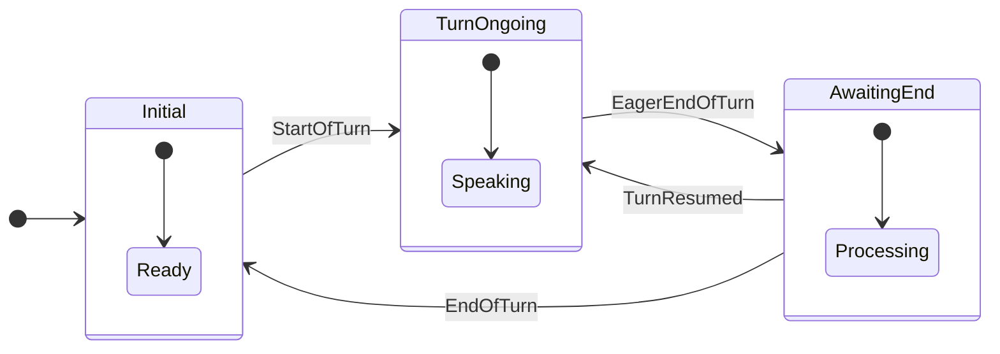

***

title: Understanding the Flux State Machine
subtitle: >-
Traditional STT+VAD requires you to build complex interruption logic. Flux
handles this natively.
slug: docs/flux/state
---------------------

Emitted events adhere to the below state machine for managing turns:



1. `Update` messages are sent for approximately every 0.25 seconds of transcribed audio, regardless of transcript updates, unless a state change has occurred.
2. An `EagerEndOfTurn` message always contains a nonempty transcript.
3. A `TurnResumed` message can only follow a preceding `EagerEndOfTurn` message.
4. The `EndOfTurn` transcript will always match the immediately preceding `EagerEndOfTurn` transcript. If the transcript changes after an `EagerEndOfTurn`, a `TurnResumed` event will occur first.
5. The `turn_index` increments immediately following an `EndOfTurn` message.

<Info>
  **Configuring Event Behavior**: The `EagerEndOfTurn` and `TurnResumed` events are only triggered when you set the `eager_eot_threshold` parameter. The `EndOfTurn` event behavior is controlled by `eot_threshold` and `eot_timeout_ms` parameters. See the [End-of-Turn Configuration](/docs/flux/configuration) for details on tuning these thresholds for your use case.
</Info>

## Turn Lifecycle Example

Here's how Flux processes a customer calling support saying "Hi I need to cancel my subscription please."

Notice how confidence builds up and how the `EagerEndOfTurn` event fires before the final `EndOfTurn`. With `EagerEndOfTurn`, your voice agent can begin preparing a response before the user has fully finished speaking. This allows you to send a synchronous request with early context, creating the effect of a faster, more natural reply.

```json
{
  "event": "Update",
  "turn_index": 0,
  "audio_window_start": 0.0,
  "audio_window_end": 0.2,
  "transcript": "",
  "words": [],
  "end_of_turn_confidence": 0.1
}

{
  "event": "Update",
  "turn_index": 0,
  "audio_window_start": 0.0,
  "audio_window_end": 0.5,
  "transcript": "",
  "words": [],
  "end_of_turn_confidence": 0.1
}

{
  "event": "StartOfTurn",
  "turn_index": 0,
  "audio_window_start": 0.0,
  "audio_window_end": 0.6,
  "transcript": "Hi I",
  "words": [
    {
      "word": "Hi",
      "confidence": 0.95
    },
    {
      "word": "I",
      "confidence": 0.92
    }
  ],
  "end_of_turn_confidence": 0.1
}

{
  "event": "Update",
  "turn_index": 0,
  "audio_window_start": 0.0,
  "audio_window_end": 0.8,
  "transcript": "Hi I need to",
  "words": [...],
  "end_of_turn_confidence": 0.1
}

{
  "event": "Update",
  "turn_index": 0,
  "audio_window_start": 0.0,
  "audio_window_end": 1.0,
  "transcript": "Hi I need to cancel my subscription.",
  "words": [...],
  "end_of_turn_confidence": 0.3
}

{
  "event": "EagerEndOfTurn",
  "turn_index": 0,
  "audio_window_start": 0.0,
  "audio_window_end": 1.1,
  "transcript": "Hi I need to cancel my subscription.",
  "words": [...],
  "end_of_turn_confidence": 0.3
}

{
  "event": "TurnResumed",
  "turn_index": 0,
  "audio_window_start": 0.0,
  "audio_window_end": 1.2,
  "transcript": "Hi I need to cancel my subscription please",
  "words": [...],
  "end_of_turn_confidence": 0.1
}

{
  "event": "Update",
  "turn_index": 0,
  "audio_window_start": 0.0,
  "audio_window_end": 1.4,
  "transcript": "Hi I need to cancel my subscription please.",
  "words": [...],
  "end_of_turn_confidence": 0.3
}

{
  "event": "EagerEndOfTurn",
  "turn_index": 0,
  "audio_window_start": 0.0,
  "audio_window_end": 1.5,
  "transcript": "Hi I need to cancel my subscription please.",
  "words": [...],
  "end_of_turn_confidence": 0.3
}

{
  "event": "Update",
  "turn_index": 0,
  "audio_window_start": 0.1,
  "audio_window_end": 1.6,
  "transcript": "Hi I need to cancel my subscription please.",
  "words": [...],
  "end_of_turn_confidence": 0.5
}

{
  "event": "EndOfTurn",
  "turn_index": 0,
  "audio_window_start": 0.0,
  "audio_window_end": 1.7,
  "transcript": "Hi I need to cancel my subscription please.",
  "words": [...],
  "end_of_turn_confidence": 0.7
}
```
