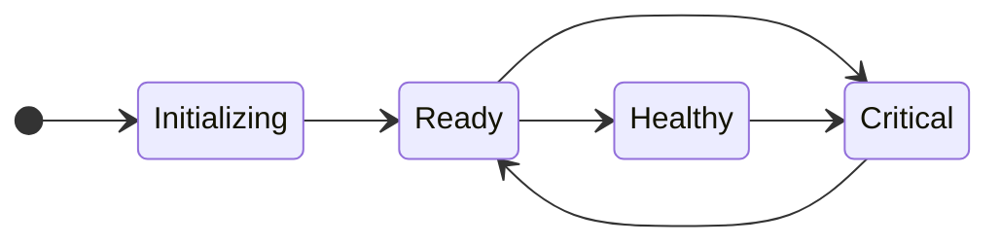

***

title: Status Endpoint
subtitle: Monitor self-hosted node health and readiness.
slug: docs/self-hosted-status-endpoint
--------------------------------------

The `/v1/status` endpoint provides real-time health and readiness information for your Deepgram self-hosted nodes. This endpoint is essential for monitoring your deployment and integrating with load balancers, orchestration platforms, and health check systems.

## Overview

The status endpoint reports the current operational state of a Deepgram node, tracking it through various states as it starts up, serves requests, and responds to runtime conditions. The endpoint helps prevent false critical alerts and provides accurate information about whether a node is ready to handle requests.

## Response Format

The status endpoint returns a JSON object with the following fields:

```json
{
  "system_health": "Healthy",
  "active_batch_requests": 0,
  "active_stream_requests": 0
}
```

* **`system_health`**: The current state of the node (`Initializing`, `Ready`, `Healthy`, or `Critical`)
* **`active_batch_requests`**: Number of pre-recorded transcription requests currently being processed
* **`active_stream_requests`**: Number of real-time streaming requests currently active

## Status States

The `system_health` field reports one of four possible states:

### Initializing

**Reported during node startup.** When a Deepgram API node first starts, it reports `Initializing` status while it:

* Establishes connections to Engine drivers
* Loads configuration
* Prepares to service requests

The node automatically transitions to `Ready` once initialization completes successfully.

**Example Response:**

```json
{
  "system_health": "Initializing",
  "active_batch_requests": 0,
  "active_stream_requests": 0
}
```

### Ready

**The node can service requests.** Once initialization is complete, the node transitions to `Ready` status, indicating it is capable of handling transcription and other API requests.

From the `Ready` state, the node will:

* Transition to `Healthy` after successfully processing enough requests
* Transition to `Critical` if errors occur during request processing

**Example Response:**

```json
{
  "system_health": "Ready",
  "active_batch_requests": 2,
  "active_stream_requests": 1
}
```

### Healthy

**Sustained successful operation.** After a node has successfully processed multiple requests, it transitions to `Healthy` status, indicating stable, production-ready operation.

A `Healthy` node can transition to `Critical` if failures arise during request processing.

**Example Response:**

```json
{
  "system_health": "Healthy",
  "active_batch_requests": 0,
  "active_stream_requests": 0
}
```

### Critical

**Node is experiencing failures.** When a node encounters errors that prevent it from successfully servicing requests, it transitions to `Critical` status.

This state indicates:

* The node is experiencing operational issues
* Requests may fail or produce errors
* Intervention may be required

A node in `Critical` status can recover and transition back to `Ready` once it can successfully service requests again.

**Example Response:**

```json
{
  "system_health": "Critical",
  "active_batch_requests": 0,
  "active_stream_requests": 0
}
```

## State Transitions

The following diagram illustrates how nodes transition between states:



1. **Initializing → Ready**: Automatic transition when node startup completes
2. **Ready → Healthy**: After processing enough successful requests
3. **Ready → Critical**: If errors occur during request processing
4. **Healthy → Critical**: If failures arise during operation
5. **Critical → Ready**: When the node can successfully service requests again

## Using the Status Endpoint

### Making a Request

Query the status endpoint with a simple GET request:

<CodeGroup>
  ```shell cURL
  curl http://localhost:8080/v1/status
  ```

  ```python Python
  import requests

  response = requests.get("http://localhost:8080/v1/status")
  status = response.json()
  print(f"Node status: {status['system_health']}")
  print(f"Active batch requests: {status['active_batch_requests']}")
  print(f"Active stream requests: {status['active_stream_requests']}")
  ```

  ```javascript JavaScript
  const response = await fetch('http://localhost:8080/v1/status');
  const status = await response.json();
  console.log(`Node status: ${status.system_health}`);
  console.log(`Active batch requests: ${status.active_batch_requests}`);
  console.log(`Active stream requests: ${status.active_stream_requests}`);
  ```
</CodeGroup>

### Integration with Load Balancers

Configure your load balancer to use the status endpoint for health checks. Different states may require different handling:

* **Initializing**: Consider the node unhealthy/not ready
* **Ready**: Node is healthy and can receive traffic
* **Healthy**: Node is healthy and can receive traffic
* **Critical**: Remove node from rotation or reduce traffic

**Example: AWS Application Load Balancer**

```yaml
Health Check Configuration:
  Protocol: HTTP
  Path: /v1/status
  Healthy threshold: 2
  Unhealthy threshold: 2
  Timeout: 5 seconds
  Interval: 30 seconds
  Success codes: 200
```

### Integration with Kubernetes

Use the status endpoint for liveness and readiness probes:

```yaml
apiVersion: v1
kind: Pod
metadata:
  name: deepgram-api
spec:
  containers:
  - name: api
    image: quay.io/deepgram/self-hosted-api:release-251029
    livenessProbe:
      httpGet:
        path: /v1/status
        port: 8080
      initialDelaySeconds: 30
      periodSeconds: 10
    readinessProbe:
      httpGet:
        path: /v1/status
        port: 8080
      initialDelaySeconds: 10
      periodSeconds: 5
      successThreshold: 1
      failureThreshold: 3
```

### Monitoring and Alerting

The status endpoint is valuable for monitoring dashboards and alerting systems:

<CodeGroup>
  ```python Python Monitoring Script
  import requests
  import time

  def check_node_status(url):
      try:
          response = requests.get(f"{url}/v1/status", timeout=5)
          data = response.json()
          status = data['system_health']
          batch_requests = data['active_batch_requests']
          stream_requests = data['active_stream_requests']

          if status == 'Critical':
              alert(f"Node {url} is in Critical state!")
          elif status == 'Initializing':
              log(f"Node {url} is still initializing...")
          else:
              log(f"Node {url} is {status} - "
                  f"Batch: {batch_requests}, Stream: {stream_requests}")

          return status
      except Exception as e:
          alert(f"Failed to check status for {url}: {e}")
          return None

  # Check every 30 seconds
  while True:
      check_node_status("http://localhost:8080")
      time.sleep(30)
  ```
</CodeGroup>

## Best Practices

### Startup Handling

During node deployment or restart:

1. Wait for the `Initializing` state to transition to `Ready` before sending production traffic
2. Allow adequate time for initialization (typically 30-60 seconds)
3. Configure health checks with appropriate initial delays

### Error Recovery

When a node enters `Critical` state:

1. Check node logs for specific error messages
2. Verify Engine connectivity and resource availability
3. Monitor for automatic recovery to `Ready` state
4. Consider restarting the node if it remains in `Critical` state

### High Availability

For production deployments:

1. Deploy multiple API nodes for redundancy
2. Configure load balancers to remove `Critical` nodes from rotation
3. Set up automated alerts for `Critical` state transitions
4. Monitor the proportion of nodes in each state across your deployment

### Monitoring Active Requests

Use the `active_batch_requests` and `active_stream_requests` fields to:

* Track node utilization and load distribution
* Identify nodes that may be overloaded
* Plan capacity based on request patterns
* Implement graceful shutdowns by waiting for active requests to complete

## Troubleshooting

### Node Stuck in Initializing

If a node remains in `Initializing` state for an extended period:

* Verify Engine containers are running and accessible
* Check network connectivity between API and Engine nodes
* Review API and Engine logs for initialization errors
* Ensure proper configuration in `api.toml` and `engine.toml`

### Frequent Critical State Transitions

If nodes frequently transition to `Critical`:

* Review Engine resource allocation (GPU/CPU/memory)
* Check for model loading issues or corrupted model files
* Verify license validity and connectivity to license servers
* Monitor for request patterns that may cause failures

### Status Endpoint Not Responding

If the status endpoint is unreachable:

* Verify the API container is running: `docker ps`
* Check API logs: `docker logs <container_id>`
* Ensure port 8080 is accessible and not blocked by firewall rules
* Verify the API container has started successfully

***

## What's Next

Now that you understand how to monitor node health with the status endpoint, explore related topics:

* [Metrics Guide](/docs/metrics-guide) - Detailed metrics and monitoring
* [System Maintenance](/docs/maintaining) - Keeping your deployment healthy
* [Prometheus Integration](/docs/prometheus-integration) - Advanced monitoring setup
