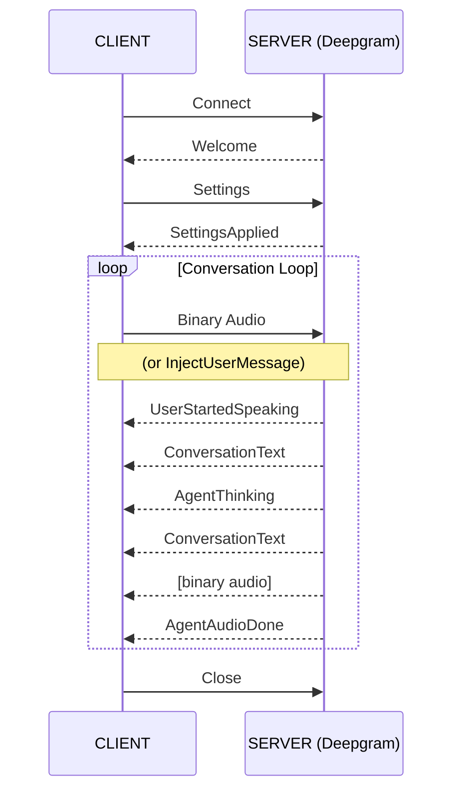

***

title: Voice Agent Message Flow
subtitle: >-
Implement the correct WebSocket message sequence for Voice Agent
conversations.
slug: docs/voice-agent-message-flow
-----------------------------------

This guide walks you through implementing the correct message flow when building a Voice Agent client. Follow these steps to establish a connection, configure settings, and handle the conversation loop.

## Establish the Connection and Receive Welcome

1. Open a WebSocket connection to the Voice Agent endpoint.

2. Wait for the server to send a `Welcome` message confirming the connection:

```json
{ "type": "Welcome", "request_id": "uuid" }
```

<Warning>
  Do not send any messages until you receive the `Welcome` message.
</Warning>

## Configure Settings and Wait for Confirmation

3. Send a `Settings` message with your audio and agent configuration:

```json
{
  "type": "Settings",
  "audio": {
    "input": {
      "encoding": "linear16",
      "sample_rate": 16000
    },
    "output": {
      "encoding": "linear16",
      "sample_rate": 24000,
      "container": "none"
    }
  },
  "agent": {
    "listen": { "model": "nova-3" },
    "think": {
      "provider": { "type": "open_ai" },
      "model": "gpt-4o-mini"
    },
    "speak": { "model": "aura-2-thalia-en" }
  }
}
```

4. Wait for the server to send a `SettingsApplied` message:

```json
{ "type": "SettingsApplied" }
```

<Warning>
  Do not send audio or inject messages until you receive `SettingsApplied`.
</Warning>

## Stream Audio and Inject Text

5. After receiving `SettingsApplied`, begin streaming binary audio data (PCM) continuously to the server.

6. Optionally, send text input using [`InjectUserMessage`](/docs/voice-agent-inject-user-message):

```json
{ "type": "InjectUserMessage", "content": "Hello" }
```

## Handle Server Events

7. Process the following events as the conversation progresses:

| Event                                                                        | Description                                                                 |
| ---------------------------------------------------------------------------- | --------------------------------------------------------------------------- |
| [`UserStartedSpeaking`](/docs/voice-agent-user-started-speaking)             | User began talking. Stop any audio playback immediately to handle barge-in. |
| [`ConversationText`](/docs/voice-agent-conversation-text)                    | User's speech has been transcribed.                                         |
| [`AgentThinking`](/docs/voice-agent-agent-thinking)                          | Agent is processing the user's input.                                       |
| [`ConversationText`](/docs/voice-agent-conversation-text)                    | Agent's text response is available.                                         |
| `[binary audio]`                                                             | Agent's audio response. Play this through your audio output.                |
| [`AgentAudioDone`](/docs/voice-agent-agent-audio-done)                       | Agent finished speaking.                                                    |
| [`Error`](/docs/voice-agent-errors) / [`Warning`](/docs/voice-agent-warning) | Issues occurred during processing.                                          |

## Message Flow Diagram



## Verify the Implementation

Confirm your implementation works correctly by checking:

* You receive a `Welcome` message immediately after connecting.
* You receive a `SettingsApplied` message after sending your `Settings`.
* The agent responds with `ConversationText` and binary audio when you speak or inject text.
* Audio playback stops when you receive `UserStartedSpeaking` (barge-in detection).

## Next Steps

* [Configure the Voice Agent](/docs/configure-voice-agent) for detailed settings options.
* [Outputs: Server Events](/docs/voice-agent-outputs) for detailed event documentation.
